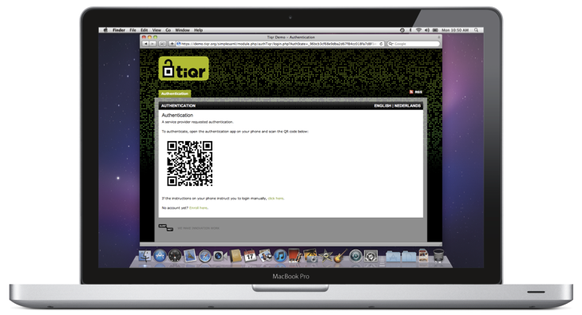
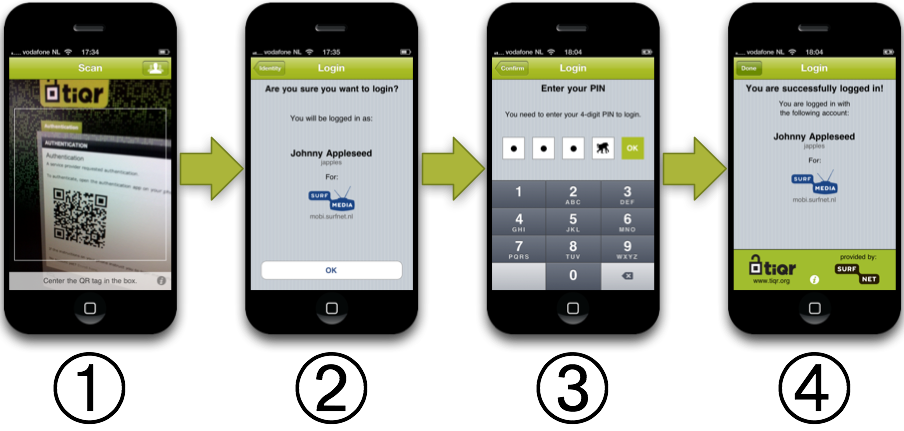

# Welcome to tiqr
Welcome to tiqr, the open source authentication solution for smart phones and web applications. For the first time, security and ease-of-use go hand in hand! Explore this site and discover how easy it is to use tiqr as an end-user or how you can integrate it into your web application with just a few bits-and-pieces that can be downloaded from the site.

And even better: tiqr is free! All source code can be downloaded from this site as well and is released under a BSD-style licence.

Learn more about tiqr by watching our short promo video:
<video width="640" height="360" controls="controls">
<source src="./TIQR-EDIT-UK-FINAL.mov" type="video/quicktime">
<source src="./TIQR-EDIT-UK-FINAL.ogv" type="video/ogg">
</video>

## So how does it work?
Logging in with tiqr is a simple process. When you land on the login page of the web application you’re trying to access your browser will show you a QR tag:

You now launch the tiqr App on your smart phone and follow the simple steps shown below:

1. Scan the QR tag
2. Confirm that you want to log in
3. Enter your PIN code
4. And you’re logged in!

### Want to try it out yourself?
Surf to [our demo page](./demo.md) and try tiqr live!