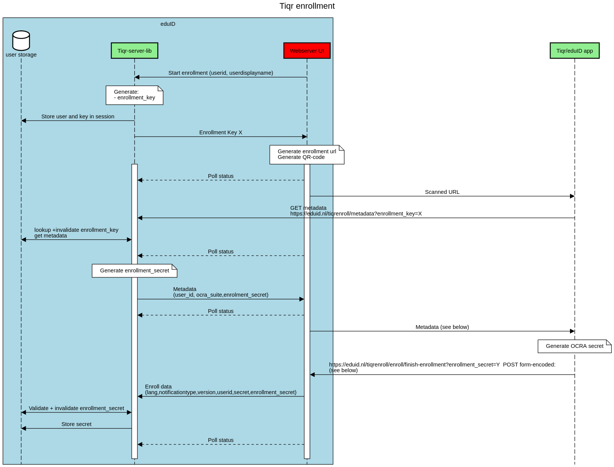
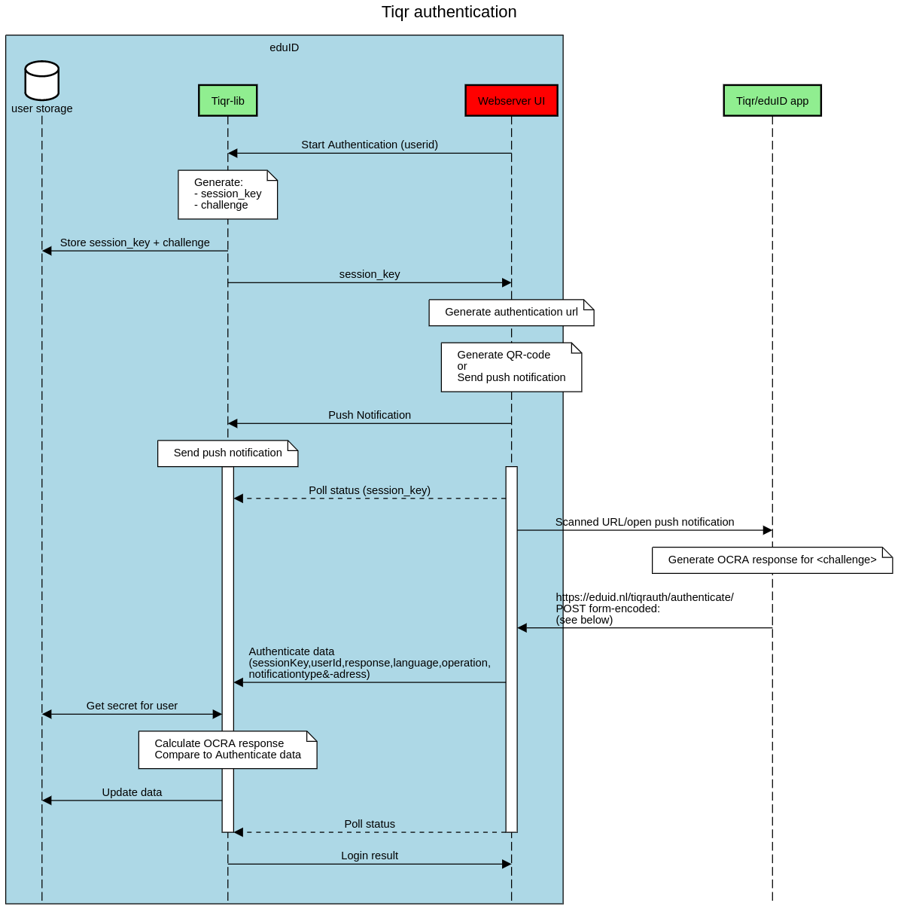

# Tiqr Protocoll

The tiqr-app and the tiqr server (website) need to communicate information during enrollment and authentication. 
## Enroll

During enrollment a user registers his Tiqr-app with the server

[](https://sequencediagram.org/index.html#initialData=C4S2BsFMAIBUQI4CdqQHZIPbnAW3cAFCEAOAhkqAMYjlrADmWAridAMTggMAWwARuGYxIAE2YBJACKEAkKLLAy-MgGcYzdSlXBMSMg0hzylEDTrA4iJAFotAN0i2u-Dl16MkkdMYrVaZPTQAOqQ-A5O0ACqEhxeooTootDEJv4WVsgA9GKSUtBkJGyc3HxM3mjEoeFOjigxNgB88Mh2tU42LgBcAMpKlKgY2HgE0AAUmk4gogA00JNIoiCqJOBkAJ5oZPgAlIRomMAwmHWZthHOIPxdAOLoToqQXQA6aDaDWDj49AD6ANaQdbEFrndqXfhNBbQHR6AxPPp6DRaApoZIA9bQEBoaGQVSqECYSqEEFtJB1TpXJrVC7RCRdACiQy+owA0oDoAANYgHI7QE6Ralg2m3e76XnoT4jILMJDgV53NAPXkARQASjYqJhREZCGQqKB7I8QmEaTFdfqQIbeSSLhT+IRBWTIg0mjawXaugAFYbQpTATRVE1ChrNaw5cTSApFLrQHpUQKK5JRVUAGWBYdykcKJFd1lJ5O6N3psGg+CUCiUrz4wBIqi6WXDzGmADo0OAsqBkBLhlky2QK2QAPzd5m-dEAXi5xLztpcAB5IciYfpDF1wJhMH9WNAANRYw1cCsiJlS4D-QGvQyWPsDwM1J31CQ2XOtWdXL0+nSKAPcw7HU5ug+HoKkqx6St8Z7qFQXhENOr7ui4VJBg+woALKQOWihkK8ExaD80xzJg0FkD8qhNkcMwjhBpGQNBGF7A6yGnC6obwUB3Tejgvrfqod6mk+rFII2WbRuhmFKOM6gwPwkDrgA7gxPL-pEILCfk2YxiBYowAA8gAwqqACCOJ0bBqmZupRRIfezF0tWtb1o2LZth21gju27lZAAZliyw8DY7kQcOJ7UVBMHjgAmtA0CejpPQll5ei4AFaCatqogvGgYxSdAMnyQxjq2S+oLse+jKStAA44WsaAMDMPIgD58agISwDrCQkAzHU+KEjMCwEWFGGUSFBA0aZDGAQWVwLo0ULLnCXQAGpkIeRo7piaAHtMRqBaNg1mTOCGUrNS66Cu8JnTA+18cGT7FfmHQcZ+fo-sQxBAA)

### enrollment url
The url for enrolling a new user contains a link to the metadata on the tiqr service. This url can be presented as a QR code and a clickable link
e.g. 
- `https://eduid.nl/tiqrenroll/?metadata=https%3A%2F%2Feduid.nl%2Ftiqrenroll%2F%3Fkey%3DX`
- `tiqrenroll://https://tiqr.test.surfconext.nl/tiqr.php?key=X`

The app will fetch the metadata and start enrolling the new user

### Metadata format
```json
{
   "service":{
      "displayName":"TestServerController http:\/\/localhost:8001",
      "identifier":"localhost",
      "logoUrl":"http:\/\/localhost:8001\/logoUrl",
      "infoUrl":"http:\/\/localhost:8001\/infoUrl",
      "authenticationUrl":"http:\/\/localhost:8001\/authentication",
      "ocraSuite":"OCRA-1:HOTP-SHA1-6:QH10-S064",
      "enrollmentUrl":"http:\/\/localhost:8001\/finish-enrollment?enrollment_secret=Y"
   },
   "identity":{
      "identifier":"test-user",
      "displayName":"test user name"
   }
}

```

### POST /finish_enrollment FORM DATA
```
secret=Z
language=nl
notificationAddress=1234567890
notificationType=GCM
operation=register
```

## Authentication

[](https://sequencediagram.org/index.html#initialData=C4S2BsFMAIBUQI4CdoEMCuwAWkB2oBjVUAe1wChyAHVJQkG-AcyRPSugGJwQmtgARuHQxIAE3QBJACLkAkGOKoBqAM4x06lKuAkkqJpGq16jYHERIAtDwFcefYC0h55NOiAINU+aAHVIAS0AN0gUAFVJLiRxcjwxaEp3Ux9zeGQAenEpaTQqDm5efmdXcnTrWwAeKwCgsNCIyQAuAGVgE2gAQUwcfE9iEDJoAApNMJAxAEpyXBJgGBIGi2QbEAEmgHE8MOJIJoAdXCtodVVVQdwAfQBrSABPQ+OCLFRwKFxDSnIx7V19Q2q5VW6zaehgp3OZBu92gAGpoM9Xu9PkDbFYAHy1EJhaCRJoQi7Qu6UWbzaCLHFY+o4vFbXA7MkYbB4QgDIboJDgElzBZLKlIJa07b6MkARQASlYCCQxJBDnpDi14tAqJosNBSSAAGb9UgUcj8wWSDGotZNAAKaugADk5trdRduWSKShTSDlarVOrNTqiHrKKgCKBgrt-IFsY1yIHg6G3Qbw9TGlYTZZgRaSG8Tu1gJoRgSobc7tN43UBTTjejylkJDI8lQmtAWkRcPSEuFxQAZDIkKh4FVWn0OshO3k4qvZWuofKbYWhgDyAGFxZ1oDFVFQyOpoFq9NBKoi3nhDOjKOOa7kp1QMYby01+MAqKomhlq+gJgA6XDgDKgZBMrAZP+LK6pAGSHOac4tLA256AAtlYeDSrKYgHLgwzqDAAiQOAJAAO7FjeSaVqmthNN0zJ9H6MCKO0hzoZAZwXAA0vcAA0PySGIrFrhuuDqKx4A+Ew6AGJArE9gyFysYcg5+hcwB3L2ABkVioGIa6qMWbrVOiPxZnookzuY6gEDE5g7igPwjuSSxuk0C6vAQ6CCWSi7LquDG8eohwLiQsHuDAuhdD0wFUdANGoF8boYnpOgGYYTThFQNHUUolCEbixopispHmhm4BZsQmjkLK0YgCGZJxqVQblaGGWRGUJFrNeCZlo0TQdiQTAgLgHmqM5wBfF8QA)

### Authentication url
The url for authentiocating a user contains all information for the app to start an authentication. This url can be presented as a push-message, QR code or a clickable link.
e.g.

- `https://eduid.nl/tiqrauth/?u=<userid>&s=<session_key>&q=<challenge/question>&i=<server_idenitfier>&v=<version>`
- `tiqrauth://<userId>@tiqr.surfconext.nl/<session_key>/<challenge>/<server_idenitfier>/<version>`


### POST /authenticate FORM DATA
```
sessionKey=<sessionkey>
userId=test-user
response=012345
language=nl
operation=login
notificationType: APNS | GCM
notificationAddress: 123455667890
```
